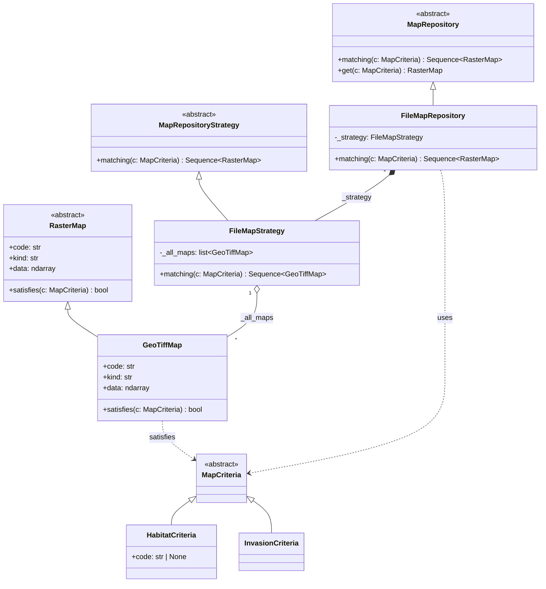
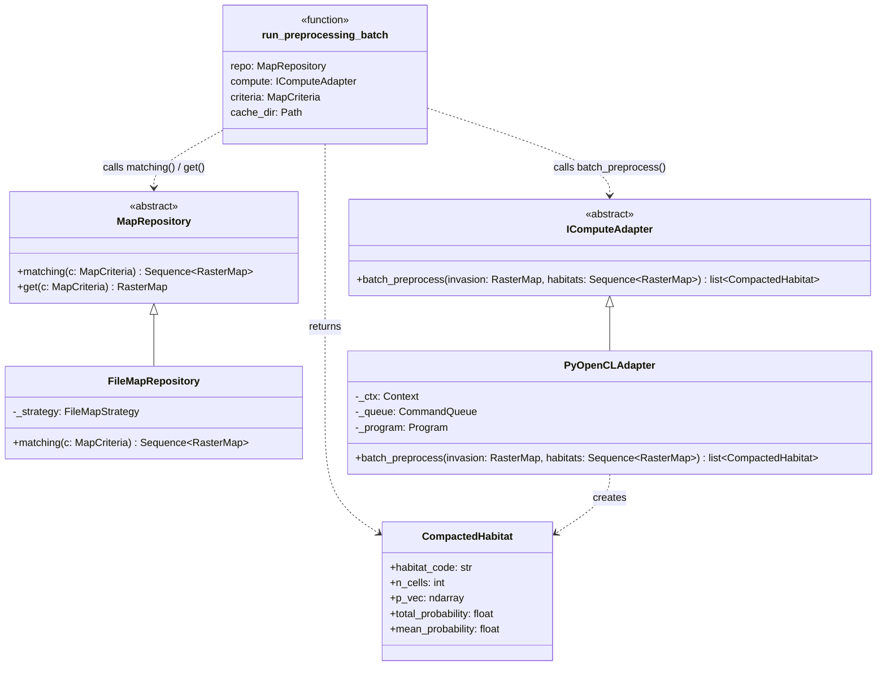

# Design Patterns

## Repository Pattern — data loading

`FileMapRepository` exposes a single interface (`matching(criteria)`) for querying raster maps, hiding all GeoTIFF access logic from the rest of the system. The concrete strategy (`FileMapStrategy`) holds the map collection in memory and delegates filtering to each `GeoTiffMap` via `satisfies()`.



### Why Criteria are objects

The key point is that a **criterion is an object**, not a parameter.

Without the pattern, the repository would have a signature like:

```python
def get_map(self, kind: str, code: str | None = None) -> RasterMap: ...
```

This works for two cases. As soon as a third query type is added, the signature grows, parameters accumulate, and the repository ends up owning all filtering logic.

With Criteria, responsibility is distributed across three actors:

| Actor | Responsibility |
|---|---|
| `MapCriteria` | carries the query parameters |
| `GeoTiffMap.satisfies()` | decides whether the map matches the criterion |
| `FileMapStrategy.matching()` | iterates maps and collects the `True` results |

The repository has no filtering logic at all:

```python
# FileMapStrategy.matching() — no filtering logic here
return [m for m in self._all_maps if m.satisfies(criteria)]
```

Adding a new query type means adding a class and one `isinstance` branch in `satisfies()`. The repository is never touched.

---

## Ports & Adapters — GPU compute layer

The preprocessing pipeline follows the **Hexagonal Architecture** (Ports & Adapters) pattern for the compute layer. The core idea is that the Service Layer never imports `pyopencl` directly — it depends only on the abstract Port `IComputeAdapter`.

### The three rings

```
┌──────────────────────────────────────────────────┐
│  INFRASTRUCTURE (Adapters)                        │
│  pyroclast/adapters/opencl_adapter.py             │
│  ┌────────────────────────────────────────────┐  │
│  │  APPLICATION CORE (Services + Domain)       │  │
│  │  pyroclast/services/preprocessing.py        │  │
│  │  pyroclast/domain/models.py                 │  │
│  │  ┌──────────────────────────────────────┐  │  │
│  │  │  PORTS (Interfaces / ABCs)            │  │  │
│  │  │  pyroclast/ABCs/compute.py            │  │  │
│  │  │  pyroclast/ABCs/repository.py         │  │  │
│  │  └──────────────────────────────────────┘  │  │
│  └────────────────────────────────────────────┘  │
└──────────────────────────────────────────────────┘
```

* **Ports** (`IComputeAdapter`, `MapRepository`) define what the application *needs* from the outside world, using only Python ABCs.
* **Adapters** (`PyOpenCLAdapter`, `FileMapRepository`) fulfil those contracts using concrete technologies (OpenCL, GeoTIFF files).
* **Services** (`run_preprocessing_batch`) orchestrate domain logic by calling Ports — never Adapters directly.

### Full class diagram



### How `PyOpenCLAdapter` is isolated from the Service Layer

The Service Layer (`run_preprocessing_batch`) receives `IComputeAdapter` as a constructor argument — it never instantiates `PyOpenCLAdapter` itself:

```python
def run_preprocessing_batch(
    repo: MapRepository,        # ← Port, not FileMapRepository
    compute: IComputeAdapter,   # ← Port, not PyOpenCLAdapter
    criteria: MapCriteria,
    cache_dir: Path,
) -> list[CompactedHabitat]: ...
```

This means:

| What changes | What is NOT affected |
|---|---|
| GPU vendor (AMD → NVIDIA) | `run_preprocessing_batch` |
| Compute framework (OpenCL → CUDA) | `run_preprocessing_batch` |
| Testing (real GPU → NumPy stub) | `run_preprocessing_batch` |

The only file that imports `pyopencl` is `pyroclast/adapters/opencl_adapter.py`. All other modules are GPU-agnostic.

### Data flow through the preprocessing pipeline

```
FileMapRepository ──→ invasion_map (RasterMap)
                  ──→ habitats     (Sequence[RasterMap])
                           │
                           ▼
              PyOpenCLAdapter.batch_preprocess()
                           │
                  ┌────────────────┐
                  │  GPU (OpenCL)  │
                  │  map_multiply  │  ← preprocessing.cl
                  └────────────────┘
                           │
                  stream compaction (NumPy)
                           │
                           ▼
              list[CompactedHabitat]  ──→  cache (.npy)
```

---

# References
- Repository pattern: [@percival2020architecture]
- Hexagonal Architecture: [@cockburn2005hexagonal]
