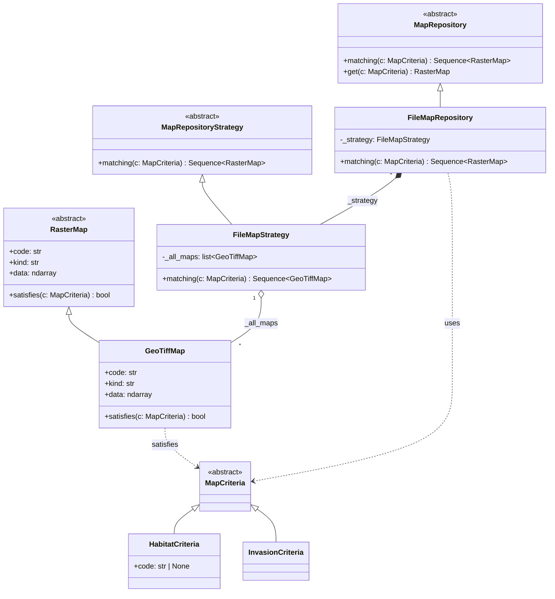

# Design Patterns

## Repository Pattern — data loading

`FileMapRepository` exposes a single interface (`matching(criteria)`) for querying raster maps, hiding all GeoTIFF access logic from the rest of the system. The concrete strategy (`FileMapStrategy`) holds the map collection in memory and delegates filtering to each `GeoTiffMap` via `satisfies()`.



### Why Criteria are objects

The key point is that a **criterion is an object**, not a parameter.

Without the pattern, the repository would have a signature like:

```python
def get_map(self, kind: str, code: str | None = None) -> RasterMap: ...
```

This works for two cases. As soon as a third query type is added, the signature grows, parameters accumulate, and the repository ends up owning all filtering logic.

With Criteria, responsibility is distributed across three actors:

| Actor | Responsibility |
|---|---|
| `MapCriteria` | carries the query parameters |
| `GeoTiffMap.satisfies()` | decides whether the map matches the criterion |
| `FileMapStrategy.matching()` | iterates maps and collects the `True` results |

The repository has no filtering logic at all:

```python
# FileMapStrategy.matching() — no filtering logic here
return [m for m in self._all_maps if m.satisfies(criteria)]
```

Adding a new query type means adding a class and one `isinstance` branch in `satisfies()`. The repository is never touched.

# References
- Repository pattern: [@percival2020architecture]
